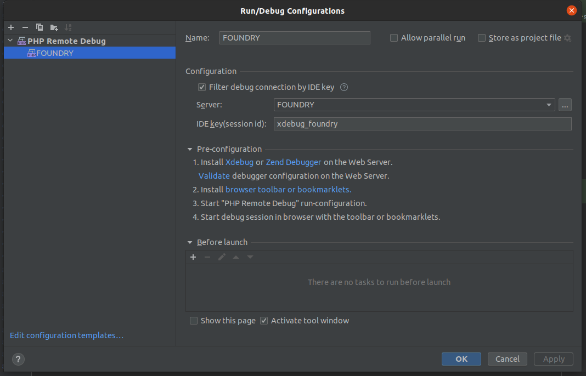

# Foundry

[](https://github.com/zenstruck/foundry/actions?query=workflow%3ACI)
[](https://codecov.io/gh/zenstruck/foundry)
[](https://packagist.org/packages/zenstruck/foundry)
[](https://packagist.org/packages/zenstruck/foundry)

Foundry makes creating fixtures data fun again, via an expressive, auto-completable, on-demand fixtures system with
Symfony and Doctrine:

```php
$post = PostFactory::new() // Create the factory for Post objects
    ->published()          // Make the post in a "published" state
    ->create([             // create & persist the Post object
        'slug' => 'post-a' // This Post object only requires the slug field - all other fields are random data
    ])
;
```

The factories can be used inside [DoctrineFixturesBundle](https://symfony.com/bundles/DoctrineFixturesBundle/current/index.html)
to load fixtures or inside your tests, [where it has even more features](https://symfony.com/bundles/ZenstruckFoundryBundle/current/index.html#using-in-your-tests).

Foundry supports `doctrine/orm` (with [doctrine/doctrine-bundle](https://github.com/doctrine/doctrinebundle)),
`doctrine/mongodb-odm` (with [doctrine/mongodb-odm-bundle](https://github.com/doctrine/DoctrineMongoDBBundle))
or a combination of these.

Want to watch a screencast 🎥 about it? Check out https://symfonycasts.com/foundry

**[Read the Documentation](https://symfony.com/bundles/ZenstruckFoundryBundle/current/index.html)**

## How to contribute

The test suite of this library needs one or more database, and static analysis needs to be ran on the smaller PHP version
supported (currently PHP 7.2), then it comes with a full docker stack.

### Install docker

You must [install docker](https://docs.docker.com/engine/install/) and [install docker-compose](https://docs.docker.com/compose/install/)
at first before running the tests.

### Run tests

The library is shipped with a `Makefile` to run tests.
Each target will build and start the docker stack and install composer only if needed.

```shell
$ make help
validate                       Run sca, full test suite and validate migrations
test                           Run PHPUnit tests suite
sca                            Run static analysis
docs                           Generate documentation to docs/output
database-generate-migration    Generate new migration based on mapping in Zenstruck\Foundry\Tests\Fixtures\Entity
database-validate-mapping      Validate mapping in Zenstruck\Foundry\Tests\Fixtures\Entity
database-drop-schema           Drop database schema
composer                       Run composer command
docker-start                   Build and run containers
docker-stop                    Stop containers
docker-purge                   Purge containers
clear                          Start from a fresh install (use it for troubleshooting)
```

Use double-dash to pass any PHPUnit options or arguments with `make`:
```shell
$ make test -- --stop-on-failure
$ make test -- --filter FactoryTest
# don't use "=" options value. ie: don't do this:
$ make test -- --filter=FactoryTest
```

Same syntax is available for composer:
```shell
$ make composer -- info symfony/*
```

#### Run tests in different environments

You can create a `.env` file to change the context in which tests will execute:
```dotenv
USE_ORM=1
USE_ODM=1
USE_DAMA_DOCTRINE_TEST_BUNDLE=1
SYMFONY_REQUIRE=5.4.* # allowed values: 5.4.* | 6.0.* | 6.1.* | 6.2.*
PHP_VERSION=8.0 # allowed values: 8.0 | 8.1 | 8.2
PREFER_LOWEST=1 # force composer to request lowest dependencies
```

### Change docker's ports

You can also add these variables to the `.env` file to change the ports used by docker:
```dotenv
PGSQL_PORT=5434
MONGO_PORT=27018
```

### Execute commands in php container

You can execute any command into the php container using docker compose:
```shell
$ docker-compose exec php [your commmand] # or "docker compose" depending on your compose version
```

### Using xdebug with PhpStorm

The php container is shipped with xdebug activated. You can use step by step debugging session with PhpStorm: you should
create a server called `FOUNDRY` in your PHP Remote Debug, with the IDE key `xdebug_foundry`



### Troubleshooting

IF any problem occurs with the docker stack or a `make` target, try to run `make clear`.

## Migrations

Whenever an entity in the fixtures is added or updated a migration must be generated with `make migrations-generate`

## Credit

The [AAA](https://www.thephilocoder.com/unit-testing-aaa-pattern/) style of testing was first introduced to me by
[Adam Wathan's](https://adamwathan.me/) excellent [Test Driven Laravel Course](https://course.testdrivenlaravel.com/).
The inspiration for this libraries API comes from [Laravel factories](https://laravel.com/docs/master/database-testing)
and [christophrumpel/laravel-factories-reloaded](https://github.com/christophrumpel/laravel-factories-reloaded).
